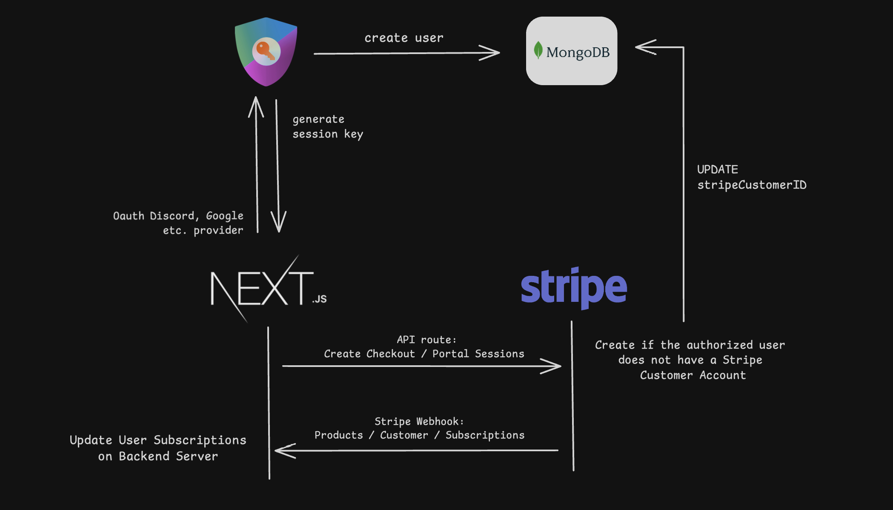

# Next.js Subscription Platform with Discord OAuth and Stripe Integration

This project is a subscription-based platform built with Next.js, allowing users to log in using Discord and subscribe to various plans using the Stripe API. The platform also handles data exchange through Stripe webhooks and stores users in MongoDB.

## Table of Contents

- [Features](#features)
- [Technologies Used](#technologies-used)
- [Architecture](#architecture)
- [Prerequisites](#prerequisites)
- [Installation](#installation)
- [Configuration](#configuration)
- [Usage](#usage)
- [Stripe Webhook Setup](#stripe-webhook-setup)
- [Contributing](#contributing)
- [License](#license)

## Features

- **Discord Authentication**: Users can log in using their Discord accounts.
- **Subscription Plans**: Users can subscribe to different plans using Stripe.
- **Stripe Integration**: Full integration with Stripe for payment processing.
- **Webhook Handling**: Receives and processes Stripe webhooks for subscription updates.
- **MongoDB Integration**: Stores user Stripe customer IDs in MongoDB.

## Technologies Used

- **Next.js**: The React framework for production.
- **Discord OAuth2**: For user authentication.
- **Stripe API**: For managing subscriptions and payment processing.
- **Stripe Webhooks**: For handling real-time updates from Stripe.
- **MongoDB**: For storing user data including Stripe customer IDs.

## Architecture



## Prerequisites

- Node.js
- npm or yarn
- Stripe account
- Discord Developer account
- MongoDB account

## Installation

1. Clone the repository:

    ```bash
    git clone https://github.com/your-username/your-repo-name.git
    cd your-repo-name
    ```

2. Install dependencies:

    ```bash
    npm install
    # or
    yarn install
    ```

## Configuration

1. Create a `.env.local` file in the root directory and add the following environment variables:

    ```env
    NEXT_BASE_URL=http://localhost:3000
    NEXTAUTH_SECRET=ultra_secret_key
    DISCORD_CLIENT_ID=your-discord-client-id
    DISCORD_CLIENT_SECRET=your-discord-client-secret
    STRIPE_PUBLIC_KEY=your-stripe-public-key
    STRIPE_SECRET_KEY=your-stripe-secret-key
    STRIPE_WEBHOOK_SECRET=your-stripe-webhook-secret
    MONGODB_URI=your-mongodb-connect-uri
    ```

2. Update your Discord OAuth2 settings in the Discord Developer Portal:

    - Redirect URI: `http://localhost:3000/api/auth/callback/discord`

3. Set up your Stripe account and add your webhook endpoint:

    - Webhook endpoint URL: `http://localhost:3000/api/webhooks/stripe`

## Usage

1. Start the development server:

    ```bash
    npm run dev
    # or
    yarn dev
    ```

2. Open your browser and navigate to `http://localhost:3000`.

3. Log in using your Discord account.

4. Subscribe to a plan using Stripe.

## Stripe Webhook Setup

To handle real-time subscription updates from Stripe, you need to set up a webhook endpoint.

1. Go to your Stripe Dashboard.
2. Navigate to Developers > Webhooks.
3. Click on "Add endpoint".
4. Set the endpoint URL to `http://localhost:3000/api/webhooks/stripe`.
5. Select the events you want to listen to, such as `invoice.payment_succeeded`, `customer.subscription.created`, `customer.subscription.updated`, and `customer.subscription.deleted`.
6. Copy the webhook signing secret and add it to your `.env.local` file as `STRIPE_WEBHOOK_SECRET`.

## Contributing

Contributions are welcome! Please fork the repository and submit a pull request with your changes.

## License

This project is licensed under the MIT License. See the [LICENSE](LICENSE) file for details.
